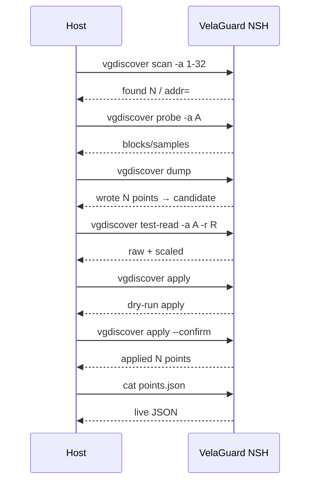

# VelaGuard 上位机 ↔ 设备主机口协议规范

版本：1.0  
适用主机：Windows PyQt5 `VelaGuard Host`（本仓库）  
适用设备：STM32H750B-DK + openvela VelaGuard（`contest2026_004_TeamFalcons`）

交叉引用（板端源码，权威行为以板端为准）：

| 能力 | 板端文件 |
|------|----------|
| 发现/候选/确认 | `app/velaguard/vgdiscover.c` |
| 配置双槽 | `app/velaguard/vgcfg.c` / `vg_config_store.c` |
| 帧质量统计 | `app/velaguard/vgstats.c` / `vg_frame_stats.c` |
| Modbus 单次读 | `app/velaguard/modbus_collector.c`（`vgmodbus`） |
| 点表 JSON 写出 | `app/velaguard/vg_point_table.c` |

实现对照：`velaguard_host/protocol.py`（命令与解析）、`velaguard_host/nsh_session.py`（行会话）。

---

## 1. 角色与边界

```text
[ Windows Host ]  --USB CDC-->  [ ST-LINK VCP ]  --NSH-->  [ openvela ]
                                                              |
                                                         RS485 主站
                                                              |
                                                         [ Modbus 从站 ]
```

- **Host**：调试/配置通道。发送 NSH 文本命令，解析回显。
- **设备**：唯一 RS485 主站。Host **不得**直接驱动 485，避免双主站。
- 本协议 **不是** 现场总线协议，也 **不是** MQTT 遥测协议。
- `vgpoint`（运行时加点 CLI）尚未在板端实现；Host 仅使用已实现命令。

## 2. 物理层

| 参数 | 值 |
|------|----|
| 接口 | ST-LINK Virtual COM Port |
| 默认端口 | `COM3`（以设备管理器为准） |
| 波特率 | 115200 |
| 数据位/校验/停止位 | 8N1 |
| 流控 | 无 |
| DTR/RTS | 打开时保持低，避免复位 |

## 3. 行协议（framing）

- 命令：一行 ASCII，以 `\n` 结束（Host 发送 `\n`；设备可回显 `\r\n`）。
- 完成：回显中出现提示符 **`nsh>`** 或 **`vela>`** 即认为该命令结束。
- 超时：Host 默认 20s；扫描/探测 60s。超时返回已收字节并报错。
- 同一时刻仅允许一条在途命令（串行化）。
- 编码：UTF-8，非法字节用 `replace` 解码后进日志。

启发式完成检测正则：

```text
(?:nsh>|vela>)\s*$
```

## 4. 命令集（Host → Device）

### 4.1 发现

| Host 构造 | 语义 | 超时建议 |
|-----------|------|----------|
| `vgdiscover scan -a MIN-MAX` | 固定 9600 扫从站 | 60s |
| `vgdiscover probe -a ADDR -t both` | 探测寄存器块 | 60s |
| `vgdiscover dump` | 推断并写 **候选** 点表 | 20s |
| `vgdiscover test-read -a ADDR -r REG -c QTY` | 单次试读（QTY≤16） | 20s |
| `vgdiscover apply` | dry-run，不落盘 | 20s |
| `vgdiscover apply --confirm` | 落盘 live 点表 + 配置槽 | 20s |

**安全**：`apply --confirm` 必须由用户显式确认；禁止与 dump/test 绑成一键。

### 4.2 配置与统计

| Host 构造 | 语义 |
|-----------|------|
| `vgcfg dump` | 读双槽配置摘要 |
| `vgcfg probe` | 探测配置槽健康 |
| `vgstats dump [slave]` | 帧质量统计 |
| `cat /data/velaguard/config/points.json` | live 点表 |
| `cat /data/velaguard/discover/point_table_candidate.json` | 候选点表 |
| `mount` | 文件系统状态 |

### 4.3 监视

| Host 构造 | 语义 |
|-----------|------|
| `vgmodbus -a ADDR -r REG -c QTY -n 1 -i 0` | 读保持寄存器一轮后退出 |

监视页周期发送 `vgdiscover test-read` 或 `vgmodbus … -n 1`。

## 5. 典型输出模式（Device → Host）

板端 printf 与 Host 正则必须保持一致；变更板端输出需同步本节与 `protocol.py`。

```text
# scan
vgdiscover: found N slave(s):
  addr=A

# probe
vgdiscover: probe addr=A blocks=M
  fc=F start=S count=C sample[0]=v0 sample[1]=v1

# test-read
vgdiscover: addr=A reg=R: [R]=raw (scaled) [R+1]=...

# apply
vgdiscover: dry-run apply → N points → PATH (use --confirm)
vgdiscover: applied N points → PATH

# vgcfg
vgcfg: OK|FACTORY seq=S schema=V committed=0|1 name=NAME

# vgstats
vgstats: slave=A window=W total=T ok=O crc=C timeout=TO echo=E other=X \
         lat_min=a lat_max=b lat_avg=c

# vgmodbus
vgmodbus: DEV addr=A fc=F start=S qty=Q
addr=A start=S: [S]=v0 [S+1]=v1 ...

# points.json（经 cat，可能夹杂提示符）
{"schema_version":1,"bus":{"device":"/dev/rs485","baud":9600},
 "hits":[1,2],"points":[{"tag":"...","addr":1,"fc":3,"reg":0,
 "qty":1,"dtype":"int16","scale":0.100,"unit":"C"}]}
```

## 6. JSON Schema（点表）

```json
{
  "schema_version": 1,
  "bus": { "device": "/dev/rs485", "baud": 9600 },
  "hits": [1, 2],
  "points": [
    {
      "tag": "string",
      "addr": 1,
      "fc": 3,
      "reg": 0,
      "qty": 1,
      "dtype": "int16",
      "scale": 0.1,
      "unit": "C"
    }
  ]
}
```

- `dtype` 当前板端以 `int16` 为主；Host 按 `raw * scale` 显示工程值。
- candidate 路径与 live 路径不同；UI 必须区分展示。

## 7. 错误语义

| 现象 | 含义 | Host 处理 |
|------|------|-----------|
| `failed` / `error` | 命令失败 | 日志标红，不更新表 |
| `Usage:` | 参数错误 | 提示参数 |
| `no saved state` | 未 scan/dump | 引导先执行 dump |
| 超时无 `nsh>` | 链路忙/未连上 | 重试或重连 |
| 打开串口失败 | 端口被占用 | 关闭其它监视器 |

## 8. 时序（推荐工作流）



## 9. 与旧二进制帧的关系

旧上位机曾实现 `EB 90 | len(2,LE) | JSON | CRC32(STM32 风) | ED` 帧，  
**板端无实现**，本项目适配后废弃，不进入本协议。历史代码保留在 git 基线提交 `8f6cd1f`。

## 10. 变更策略

1. 板端 CLI 输出变更 → 同步本文件 §5 与 `velaguard_host/protocol.py`。
2. 新增 Host 可调用命令 → 先确认板端已合入，再扩 `protocol.py` 与单测。
3. 禁止 Host 发送 Agent 未授权的写路径或绕过 `--confirm` 的落盘。
